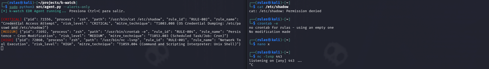

# k-watch


**k-watch** is a lightweight Linux EDR prototype built with **eBPF and Python** for real-time process execution monitoring and security event detection.

The project demonstrates how kernel-level telemetry can be collected with eBPF, passed to a user-space agent, analyzed against detection rules, and enriched with **MITRE ATT&CK** techniques and risk levels.

> k-watch is a learning and research-oriented prototype, not a production-ready EDR.

## Features

- Real-time monitoring of process execution through the `execve` system call.
- eBPF-based kernel instrumentation.
- Event delivery from kernel space to user space through a perf buffer.
- Python-based event processing and detection engine.
- Modular regex-based detection rules.
- Risk classification:
  - `INFO`
  - `MEDIUM`
  - `HIGH`
  - `CRITICAL`
- MITRE ATT&CK technique mapping.
- `--alerts-only` mode for filtering low-risk events.
- Automated unit tests with pytest.
- GitHub Actions CI for detection-rule testing.

## Architecture

```text
┌──────────────────────┐
│   Process Execution  │
│        execve()      │
└──────────┬───────────┘
           │
           ▼
┌──────────────────────┐
│     eBPF Probe       │
│  sys_enter_execve    │
└──────────┬───────────┘
           │
           │ Event
           ▼
┌──────────────────────┐
│     Perf Buffer      │
└──────────┬───────────┘
           │
           ▼
┌──────────────────────┐
│     Python Agent     │
│                      │
│  Event Processing    │
└──────────┬───────────┘
           │
           ▼
┌──────────────────────┐
│   Detection Rules    │
│                      │
│  Pattern Matching    │
└──────────┬───────────┘
           │
           ▼
┌──────────────────────┐
│   Risk + MITRE ATT&CK│
│       Enrichment     │
└──────────┬───────────┘
           │
           ▼
┌──────────────────────┐
│        Alert         │
└──────────────────────┘
```

## How It Works

k-watch follows a simple kernel-to-user-space detection pipeline.

1. A process executes a program through the Linux `execve` system call.
2. The eBPF probe attached to `sys_enter_execve` captures the execution event.
3. The event contains information such as the process ID, process name, executable path and command arguments.
4. The eBPF program sends the event to user space through a perf buffer.
5. The Python agent receives and decodes the event.
6. The event is evaluated against the detection rules defined in `src/rules.py`.
7. Matching events are assigned a risk level and a MITRE ATT&CK technique.
8. The agent prints the resulting security alert.

## Detection Rules

k-watch currently includes six modular detection rules:

| Rule | Detection | Risk | MITRE ATT&CK |
|------|-----------|------|---------------|
| RULE-001 | Network tool execution (`nc`, `netcat`, `ncat`, `socat`) | HIGH | T1059.004 |
| RULE-002 | Access to `/etc/shadow` or `unshadow` | CRITICAL | T1003.008 |
| RULE-003 | Linux history removal or shredding | HIGH | T1070.003 |
| RULE-004 | Cron modification | MEDIUM | T1053.003 |
| RULE-005 | SUID manipulation with `chmod` | HIGH | T1548.001 |
| RULE-006 | Security reconnaissance tools (`linpeas`, `linenum`, `checksec`) | MEDIUM | T1082 |

The rules are implemented in `src/rules.py` and are evaluated against the executable path and captured command arguments.

> Detection is heuristic and based on command patterns. A match does not necessarily indicate malicious activity.

## Requirements

- Linux
- Python 3
- BCC (BPF Compiler Collection)
- Linux kernel with eBPF support
- Root privileges for attaching the eBPF probe

k-watch has been tested on Kali Linux with BCC and a recent Linux kernel.

## Installation

Clone the repository:

```bash
git clone https://github.com/RaulAlcauter/k-watch.git
cd k-watch
```

Install the Python dependencies:

```bash
pip install -r requirements.txt
```

> BCC is a system-level dependency and may need to be installed separately depending on the Linux distribution.

## Usage

Run the agent from the repository root:

```bash
sudo python3 src/agent.py
```

This displays observed process execution events together with their risk level.

To display only security-relevant events:

```bash
sudo python3 src/agent.py --alerts-only
```

The `--alerts-only` mode displays events classified as `MEDIUM`, `HIGH`, or `CRITICAL`.

Press `Ctrl+C` to stop the agent.

## Example

When a suspicious process execution is detected, k-watch generates a structured alert containing the process information, matched rule, risk level and MITRE ATT&CK technique.

Example detection:

```text
[CRITICAL] {"pid": 71556, "process": "zsh", "path": "/usr/bin/cat /etc/shadow", "rule_id": "RULE-002", "rule_name": "Credential Access Attempt", "risk_level": "CRITICAL", "mitre_technique": "T1003.008 (OS Credential Dumping: /etc/passwd and /etc/shadow)"}
```

The following example shows k-watch detecting several security-relevant process executions during a live test:



Detected events included credential access, cron modification and network tool execution.

## Testing

The detection engine is covered by automated tests using pytest.

Run the test suite with:

```bash
pytest -v
```

The current test suite covers:

- Detection of network tools
- Credential access detection
- History clearing
- Cron persistence
- SUID manipulation
- System reconnaissance
- Benign command handling
- False-positive prevention for similar command names

GitHub Actions automatically runs the detection-rule tests on pushes and pull requests to the `main` branch.

## Limitations

k-watch is a lightweight EDR prototype designed to demonstrate eBPF-based process monitoring and security detection.

The current implementation has several limitations:

- Monitoring is currently focused on the `sys_enter_execve` tracepoint.
- Only the executable path and the first command-line argument are captured.
- Detection rules are heuristic and based on regular-expression pattern matching.
- Some legitimate activity may trigger alerts and require further investigation.
- The project does not currently provide automated response or remediation.
- There is no persistent event storage or centralized management component.
- The eBPF integration requires a Linux system with eBPF and BCC support.
- The GitHub Actions workflow tests the Python detection engine but does not execute the live eBPF component.

These limitations are intentional for the scope of the project. The goal is to provide a small, understandable prototype demonstrating the fundamentals of kernel-level telemetry and security detection rather than a production-ready endpoint security platform.

## Project Structure

```text
k-watch/
├── src/
│   ├── agent.py          # User-space EDR agent
│   ├── ebpf_probe.c      # eBPF kernel probe
│   └── rules.py          # Detection rules
├── tests/
│   └── test_rules.py     # Detection engine tests
├── .github/
│   └── workflows/
│       └── tests.yml     # GitHub Actions CI
├── requirements.txt
├── README.md
└── LICENSE
```
